# TidyTuesday

TidyTuesday project is a weekly appointment that happens on every Tuesday for practicing making #DataVisualization with datasets provided by the **#R4DS Online Learning Community**

Several TidyTuesday interesting examples can be found in the main repository:

-   <https://github.com/rfordatascience/tidytuesday>

------------------------------------------------------------------------

#### How to make a #TidyTuesday (more info at the bottom of this page)

------------------------------------------------------------------------

### My contributions are posted on:

#### Twitter \@[fgazzelloni](https://twitter.com/fgazzelloni) and collected in this repository with related code.

------------------------------------------------------------------------

#### Other #DataViz projects I contribute to:

|                                                                                        |                                                                                             |
|-----------------------------------|-------------------------------------|
| [30DayChartChallenge-2021](https://github.com/Fgazzelloni/rstats-chart-challenge-2021) | [30DayMapChallenge-2021](https://github.com/Fgazzelloni/30DayMapChallenge/tree/master/2021) |
| [30DayChartChallenge-2022](https://github.com/Fgazzelloni/30DayChartChallenge)         | [30DayMapChallenge-2022](https://github.com/Fgazzelloni/30DayMapChallenge/tree/master/2022) |
| [30DayChartChallenge-2023](https://github.com/Fgazzelloni/30DayChartChallenge)         |                                                                                             |

# My #TidyTuesdays

## [2021](data/2021) \| [2022](data/2022) \| [2023](data/2023)

<!-- TABLE START -->

|                                                                                                                                                                             |                                                                                                                                                                                                                        |                                                                                                                                                                                                                                             |                                                                                                                                                                                        |
|------------------|------------------|-------------------|------------------|
| Week1 Bring your own data to start 2023                                                                                                                                | Week2 Project FeederWatcher                                                                                                                                                                                         | [Week3](data/2022/w3_chocolate) [Chocolate Bar ratings](https://github.com/rfordatascience/tidytuesday/blob/master/data/2022/2022-01-18/readme.md)                                                                                       | [Week4](data/2022/w4_board_games) [Board games](https://github.com/rfordatascience/tidytuesday/blob/master/data/2022/2022-01-25/readme.md)                                          |
| [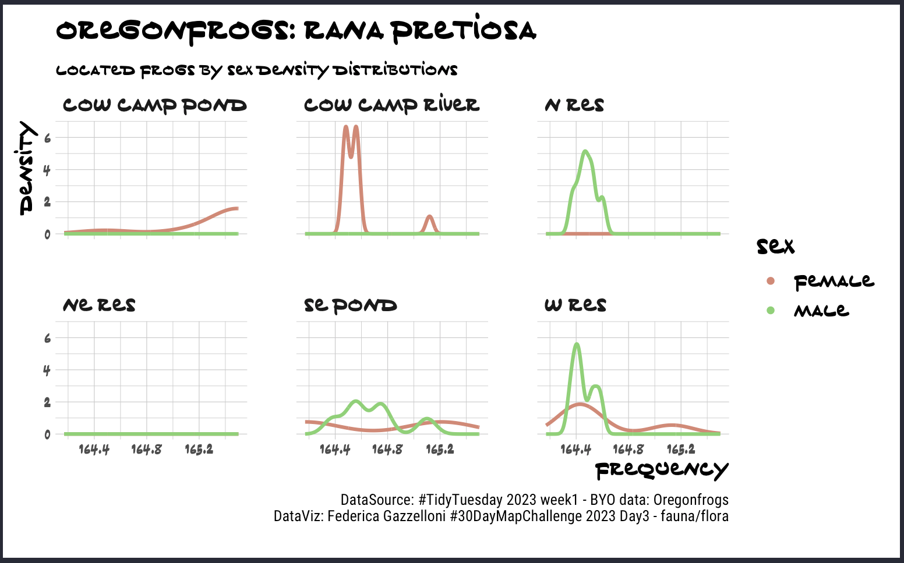](https://github.com/Fgazzelloni/TidyTuesday/blob/main/data/2023/w1_byod/w1_byo.qmd)                                                |                                                                                         |                                                                                                                                                                                               |                                                                                                                           |
| [Week5](data/2022/w5_dogs) [Dog breeds](https://github.com/rfordatascience/tidytuesday/blob/master/data/2022/2022-02-01/readme.md)                                       | [Week6](data/2022/w6_airforce) [Tuskegee Airmen](https://github.com/rfordatascience/tidytuesday/blob/master/data/2022/2022-02-08/readme.md)                                                                         | [Week7](ata/2022/w7_dubois) [`#DuBoisChallenge2022`](https://github.com/rfordatascience/tidytuesday/blob/master/data/2022/2022-02-15/readme.md)                                                                                          | [Week8](data/2022/w8_wfi) [World Freedom index](https://github.com/rfordatascience/tidytuesday/blob/master/data/2022/2022-02-22/readme.md)                                          |
|                                                                                                                       |                                                                                                                                                                   |                                                                                                                                                                                          |                                                                                                                                           |
| [Week9](data/2022/w9_stations) [Alternative Fuel Stations](https://github.com/rfordatascience/tidytuesday/blob/master/data/2022/2022-03-01/readme.md)                    | [Week10](data/2022/w10_erasmus) [Erasmus student mobility](https://github.com/rfordatascience/tidytuesday/blob/master/data/2022/2022-03-08/readme.md)                                                               | [Week11](data/2022/w11_vignettes) [CRAN/BIOC Vignettes](https://github.com/rfordatascience/tidytuesday/blob/master/data/2022/2022-03-15/readme.md)                                                                                       | [Week12](data/2022/w12_babynames) [Baby names](https://github.com/rfordatascience/tidytuesday/blob/master/data/2022/2022-03-22/readme.md)                                           |
|                                                                                                                        |                                                                                                                                                                  |                                                                                                                                                                                   |                                                                                                                              |
| [Week13](data/2022/w13_sports) [Collegiate Sports Budgets](https://github.com/rfordatascience/tidytuesday/blob/master/data/2022/2022-03-29/readme.md)                    | [Week14](data/2022/w14_digital_pub) [Digital Publications](https://github.com/rfordatascience/tidytuesday/blob/master/data/2022/2022-04-05/readme.md)                                                               | [Week15](data/2022/w15_indoor_pollution) [Indoor Air Pollution](https://github.com/rfordatascience/tidytuesday/blob/master/data/2022/2022-04-12/readme.md)                                                                               | [Week16](data/2022/w16_crosswords) [Crossword Puzzles and Clues](https://github.com/rfordatascience/tidytuesday/blob/master/data/2022/2022-04-19/readme.md)                         |
|                                                                                                                         |                                                                                                                                              |                                                                                                                                                                          |                                                                                                                             |
| [Week17](data/2022/w17_hidden_gems) [Kaggle Hidden Gems](https://github.com/rfordatascience/tidytuesday/blob/master/data/2022/2022-04-26/readme.md)                      | [Week18](data/2022/w18_solar_wind) [Solar/Wind utilities](https://github.com/rfordatascience/tidytuesday/blob/master/data/2022/2022-05-03/readme.md)                                                                | [Week19](data/2022/w19_nyt) [NYTimes best sellers](https://github.com/rfordatascience/tidytuesday/blob/master/data/2022/2022-05-10/readme.md)                                                                                            | [Week20](data/2022/w20_eurovision) [Eurovision](https://github.com/rfordatascience/tidytuesday/blob/master/data/2022/2022-05-17/readme.md)                                          |
|                                                                                                              |                                                                                                                                                            |                                                                                                                                                                                              |                                                                                                                           |
| [Week21](data/2022/w21_rugby) [Women's Rugby](https://github.com/rfordatascience/tidytuesday/blob/master/data/2022/2022-05-24/readme.md)                                 | [Week22](data/2022/w22_reputation) [Company reputation poll](https://github.com/rfordatascience/tidytuesday/tree/master/data/2022/2022-05-31)                                                                       | [Week23](data/2022/w23_pride) [Pride Corporate Accountability Project](https://github.com/rfordatascience/tidytuesday/tree/master/data/2022/2022-06-07)                                                                                  | [Week24](data/2022/w24_drought) [US Drought](https://github.com/rfordatascience/tidytuesday/tree/master/data/2022/2022-06-14)                                                       |
|                                                                                                                     |                                                                                                                                                            |                                                                                                                                                                                           |                                                                                                                                  |
| [Week25](data/2022/w25_juneteenth) [Juneteenth](https://github.com/rfordatascience/tidytuesday/tree/master/data/2022/2022-06-21)                                         | [Week26](data/2022/w26_paygap) [UK Gender pay gap](https://github.com/rfordatascience/tidytuesday/tree/master/data/2022/2022-06-28)                                                                                 | [Week27](data/2022/w27_rentals) [San Francisco Rentals](https://github.com/rfordatascience/tidytuesday/tree/master/data/2022/2022-07-05)                                                                                                 | [Week28](data/2022/w28_european_flights) [European flights](https://github.com/rfordatascience/tidytuesday/tree/master/data/2022/2022-07-12)                                        |
|                                                                                                                 |                                                                                                                                                                    |                                                                                                                                                                                       |                                                                                                                       |
| [Week29](data/2022/w29_technology) [Technology](https://github.com/rfordatascience/tidytuesday/tree/master/data/2022/2022-07-19)                                         | [Week30](data/2022/w30_BYOD) [BYOD](https://github.com/rfordatascience/tidytuesday/blob/master/data/2021/2021-08-10/readme.md)                                                                                      | [Week31](data/2022/w31_frogs) [Oregon Spotted Frog](https://github.com/rfordatascience/tidytuesday/tree/master/data/2022/2022-08-02)                                                                                                     | [Week32](data/2022/w32_ferriswheels) [ferriswheels](https://github.com/rfordatascience/tidytuesday/tree/master/data/2022/2022-08-09)                                                |
|                                                                                                                 |                                                                                                                                                                        |                                                                                                                                                                                           |                                                                                                                        |
| [Week33](data/2022/w33_psychometrics) [Open Source Psychometrics](https://github.com/rfordatascience/tidytuesday/tree/master/data/2022/2022-08-16)                       | [Week34](data/2022/w34_chips) [CHIP dataset](https://github.com/rfordatascience/tidytuesday/tree/master/data/2022/2022-08-23)                                                                                       | [Week35](data/2022/w35_pell) [Pell Grants](https://github.com/rfordatascience/tidytuesday/tree/master/data/2022/2022-08-30)                                                                                                              | [Week36](data/2022/w36_lego) [LEGO database](https://github.com/rfordatascience/tidytuesday/tree/master/data/2022/2022-09-06)                                                       |
|                                                                                                           |                                                                                                                                                                      |                                                                                                                                                                                             |                                                                                                                                        |
| [Week37](data/2022/w37_bigfoot) [Bigfoot](https://github.com/rfordatascience/tidytuesday/tree/master/data/2022/2022-09-13)                                               | [Week38](data/2022/w38_hydro_wastewater.Rmd) [Hydro Wastewater plants](https://github.com/rfordatascience/tidytuesday/tree/master/data/2022/2022-09-20)                                                             | [Week39](data/2022/w39_us_artists) [Artists in the USA](https://github.com/rfordatascience/tidytuesday/tree/master/data/2022/2022-09-27)                                                                                                 | [Week40](data/2022/w40_product_hunt) [Product Hunt products](https://github.com/rfordatascience/tidytuesday/tree/master/data/2022/2022-10-04)                                       |
|                                                                                                                       |                                                                                                                                             |                                                                                                                                                                                 |                                                                                                                        |
| [Week41](data/2022/w41_yarn) [Ravelry data](https://github.com/rfordatascience/tidytuesday/tree/master/data/2022/2022-10-11)                                             | [Week42](data/2022/w42_stranger_things_dialogue) [Stranger things dialogue](https://github.com/rfordatascience/tidytuesday/tree/master/data/2022/2022-10-18)                                                        | [Week43](data/2022/w43_gbb) [Great British Bakeoff](https://github.com/rfordatascience/tidytuesday/tree/master/data/2022/2022-10-25)                                                                                                     | [Week44](data/2022/w44_horror_movies) [Horror Movies](https://github.com/rfordatascience/tidytuesday/tree/master/data/2022/2022-11-01)                                              |
| [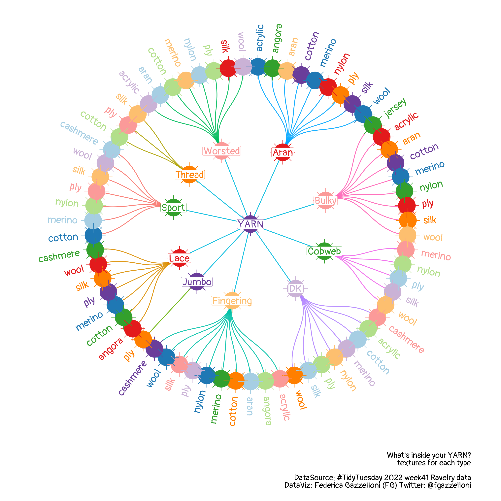](https://github.com/Fgazzelloni/TidyTuesday/blob/main/data/2022/w41_yarn/w41_yarn.R)                                      |  | [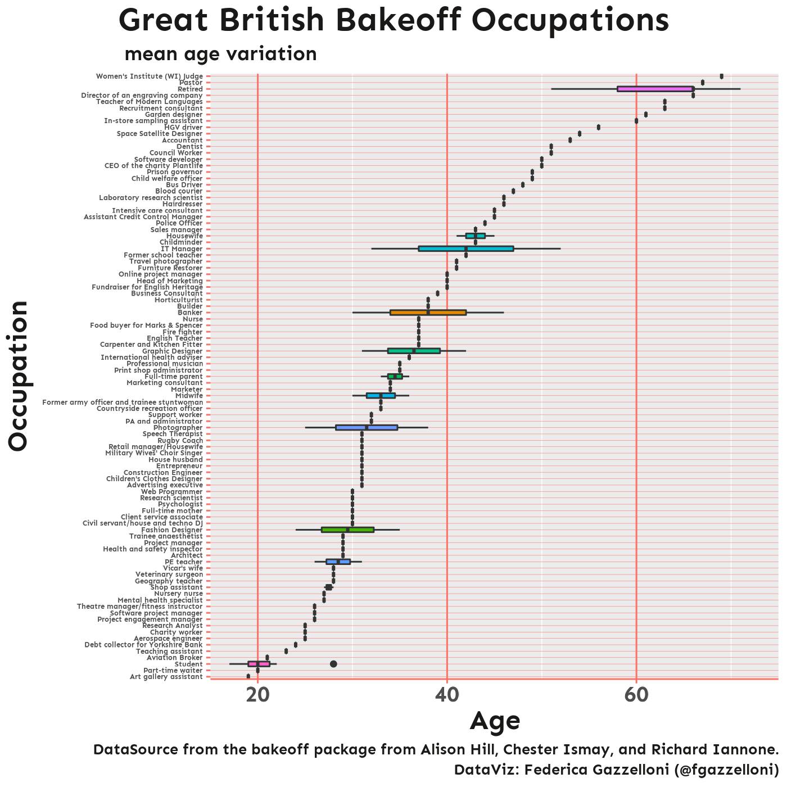](https://github.com/Fgazzelloni/TidyTuesday/blob/main/data/2022/w43_gbb/w43_gbb.Rmd)                                                                                                        | [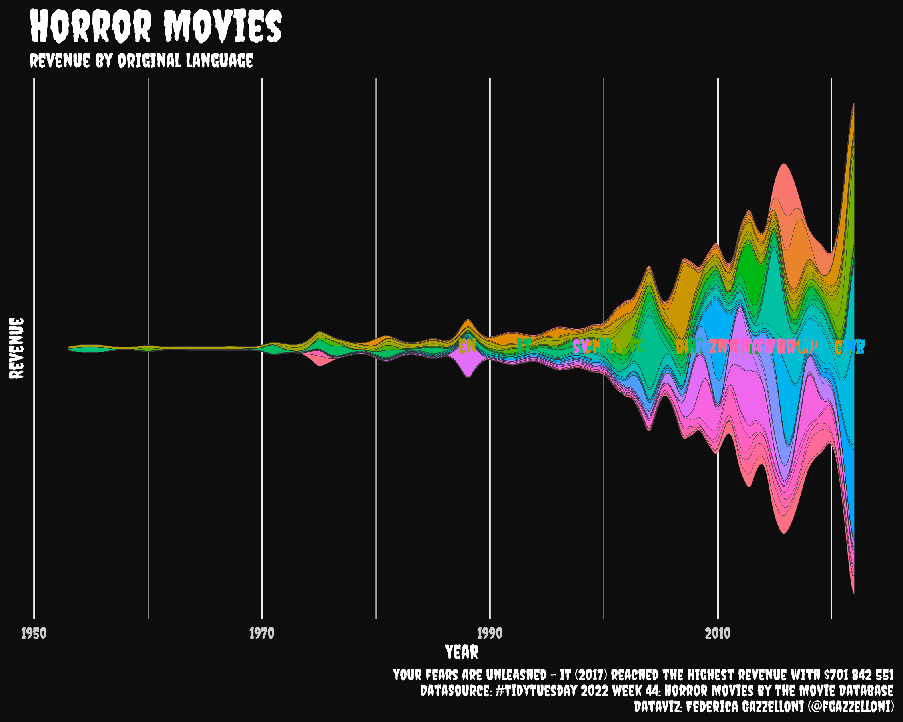](https://github.com/Fgazzelloni/TidyTuesday/blob/main/data/2022/w44_horror_movies/w44_horror_movies.Rmd)           |
| [Week45](data/2022/w45_...) [Radio Stations](https://github.com/rfordatascience/tidytuesday/tree/master/data/2022/2022-11-08)                                            | [Week46](data/2022/w46_) [Page Metrics](https://github.com/rfordatascience/tidytuesday/tree/master/data/2022/2022-11-15)                                                                                            | [Week47](data/2022/w47_) [Uk Museums](https://github.com/rfordatascience/tidytuesday/tree/master/data/2022/2022-11-22)                                                                                                                   | [Week48](data/2022/w44_) [World Cup](https://github.com/rfordatascience/tidytuesday/tree/master/data/2022/2022-11-29)                                                               |
| [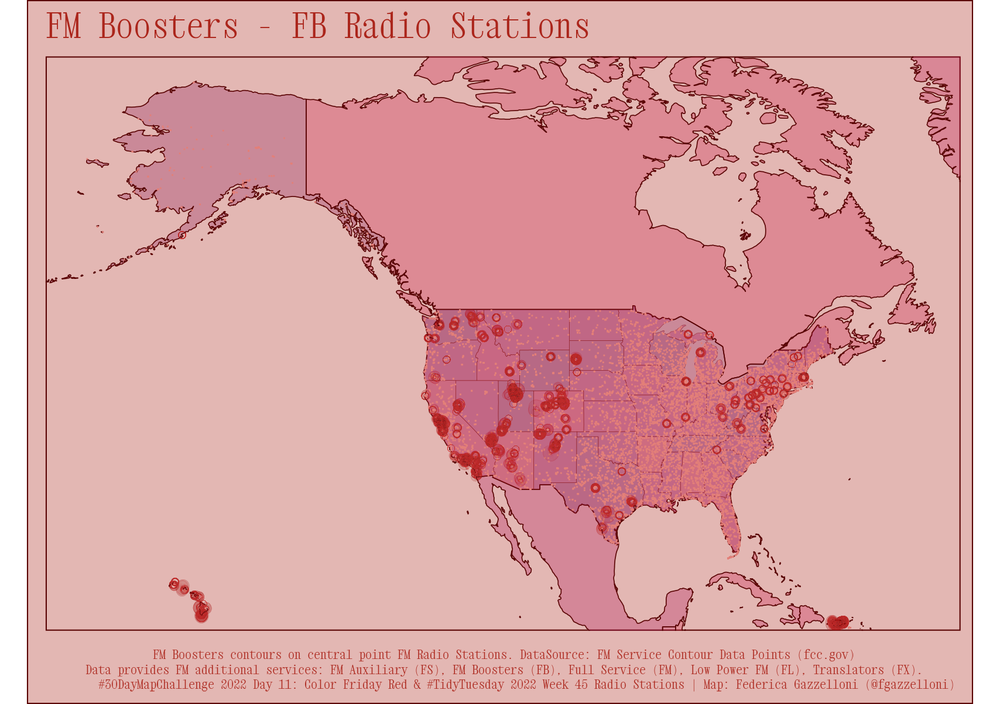](https://github.com/Fgazzelloni/TidyTuesday/blob/main/data/2022/w45_radio_stations/w45_radio_stations.Rmd) | [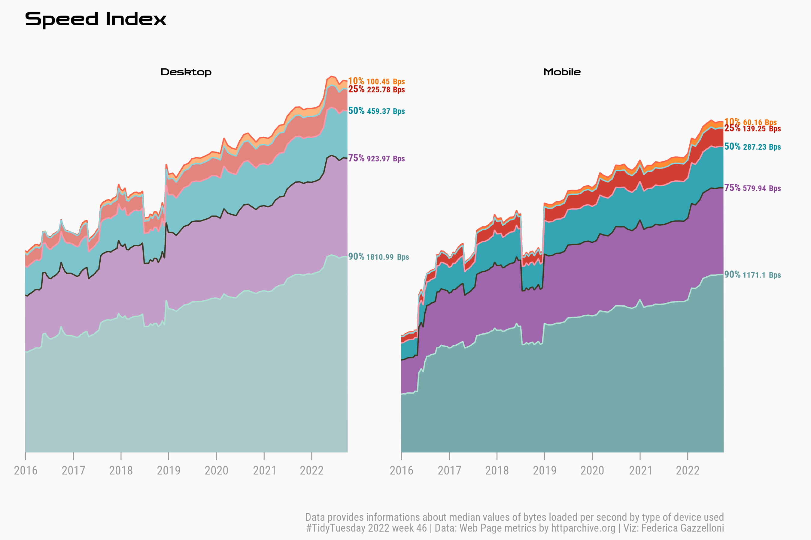](https://github.com/Fgazzelloni/TidyTuesday/blob/main/data/2022/w46_web_page_metrics/w46_web_page_metrics.Rmd)                       | [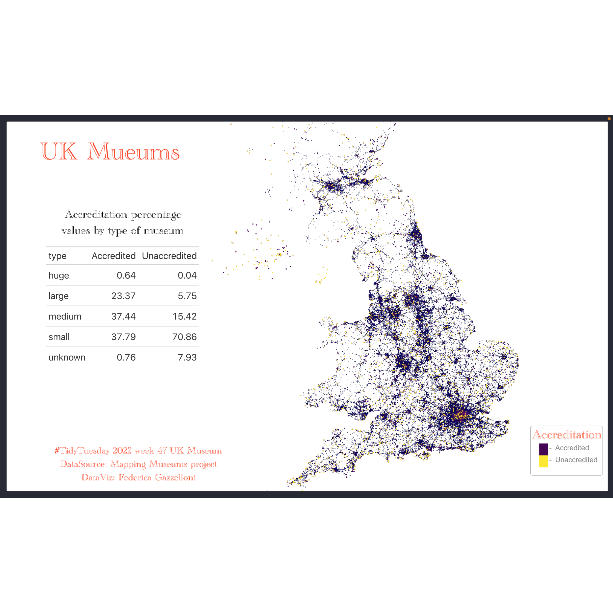](https://github.com/Fgazzelloni/TidyTuesday/blob/main/data/2022/w47_uk_museums/w47_uk_museums.Rmd)                                                                          | [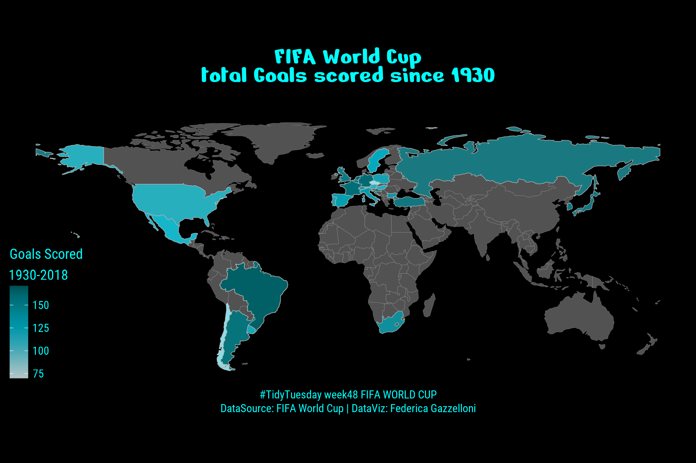](https://github.com/Fgazzelloni/TidyTuesday/blob/main/data/2022/w48_FIFA_World_Cup/w48_fifa_world_cup.Rmd) |
| [Week49](data/2022/w49_...) [Elevators](https://github.com/rfordatascience/tidytuesday/tree/master/data/2022/2022-12-06)                                                 | [Week50](data/2022/w50_) [Monthly State Retail Sales](https://github.com/rfordatascience/tidytuesday/tree/master/data/2022/2022-12-13)                                                                              | [Week51](data/2022/w47_) [Weather Forecast Accuracy](https://github.com/rfordatascience/tidytuesday/tree/master/data/2022/2022-12-20)                                                                                                    | [Week52](data/2022/w52_) [Star Trek Timelines](https://github.com/rfordatascience/tidytuesday/tree/master/data/2022/2022-12-27)                                                     |
| [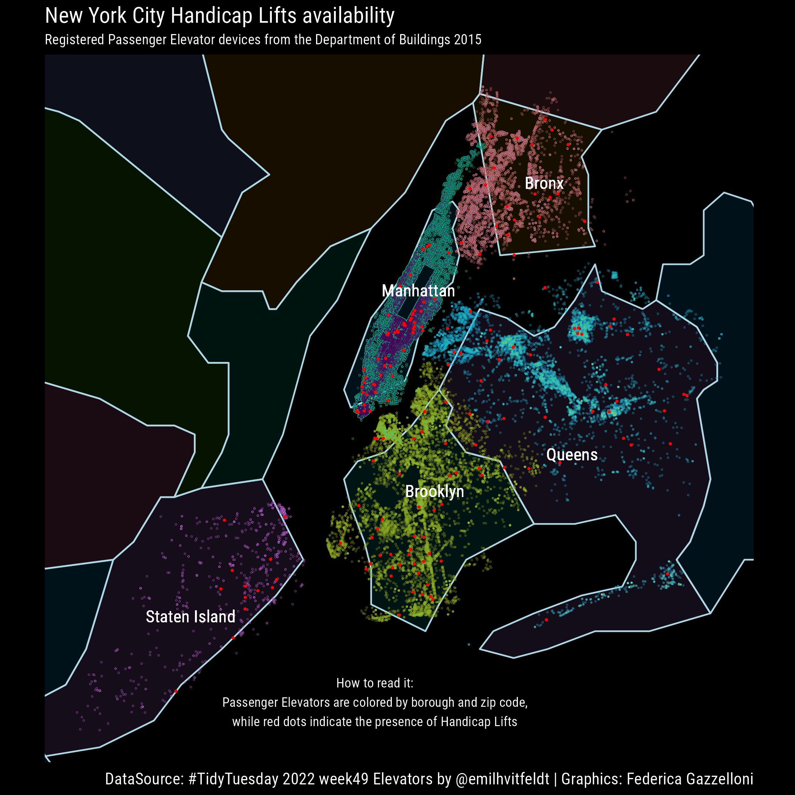](https://github.com/Fgazzelloni/TidyTuesday/blob/main/data/2022/w49_elevators/w49_elevators.Rmd)               | [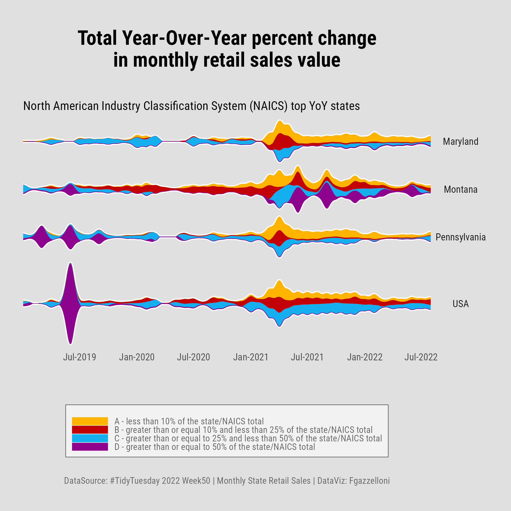](https://github.com/Fgazzelloni/TidyTuesday/blob/main/data/2022/w50_retail_sales/w50_retail_sales.Rmd)                                           | [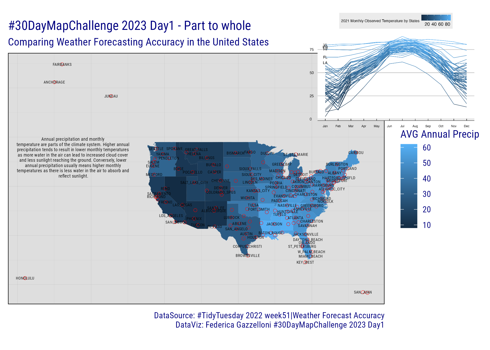](https://github.com/Fgazzelloni/TidyTuesday/blob/main/data/2022/w51_weather_forecast_accuracy/w51_weather_forecast_accuracy.Rmd) | 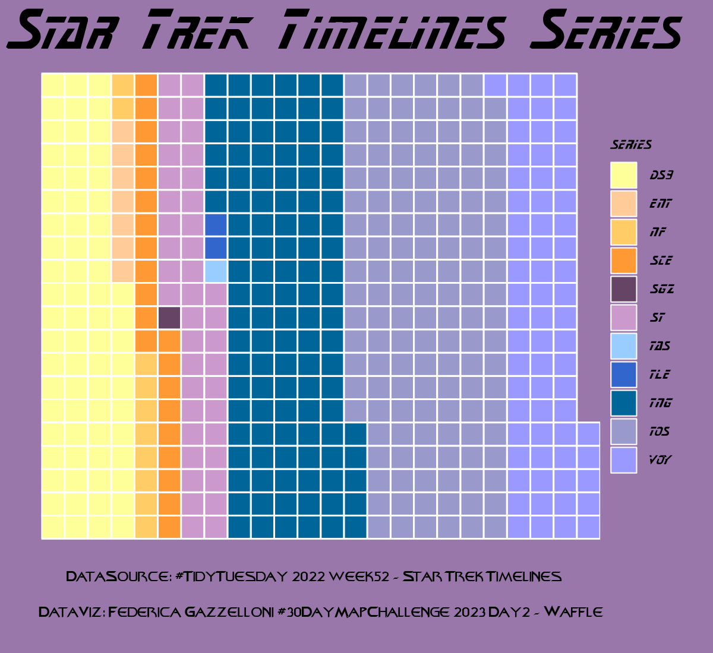                                                                                               |

------------------------------------------------------------------------

<!-- TABLE END -->

## INFO: How to make a #TidyTuesday

-   Go to [R4DataScience GitHub repository](https://github.com/rfordatascience/tidytuesday)

-   import data found in the [README](https://github.com/rfordatascience/tidytuesday/blob/master/README.md) at the middle bottom of the page is a table with the most updated data provided for the year/week

-   click on the corresponding data tab in the table

-   load the data, two options are available:

    1.  Install {tidytuesdayR} package from CRAN via: `install.packages("tidytuesdayR")`, then load the data as suggested assigning a tuesdata variable name using the `tt_load()` function:

        `tuesdata <- tidytuesdayR::tt_load("date")`

        `tuesdata <- tidytuesdayR::tt_load(year, week)`

    2.  Import the data directly from the .csv file provided
