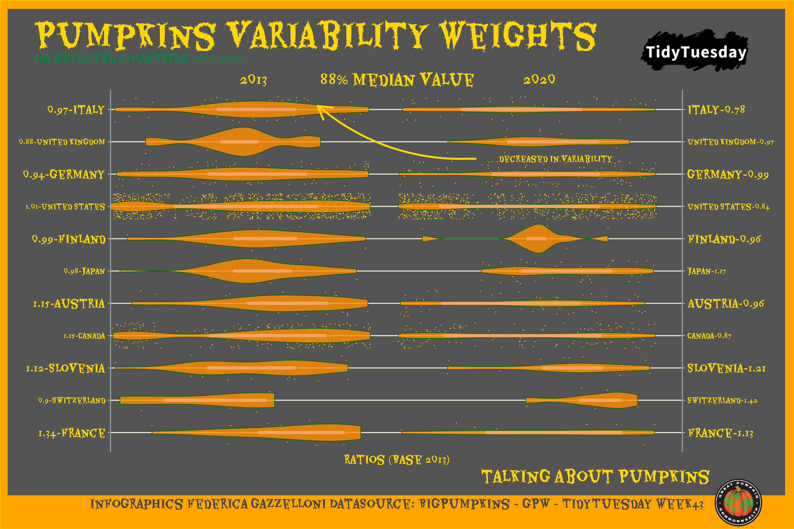
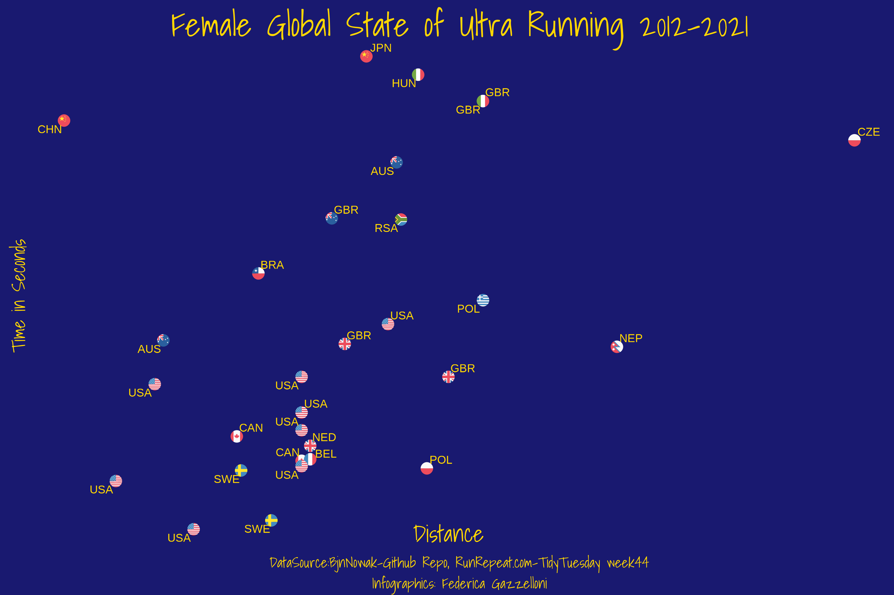
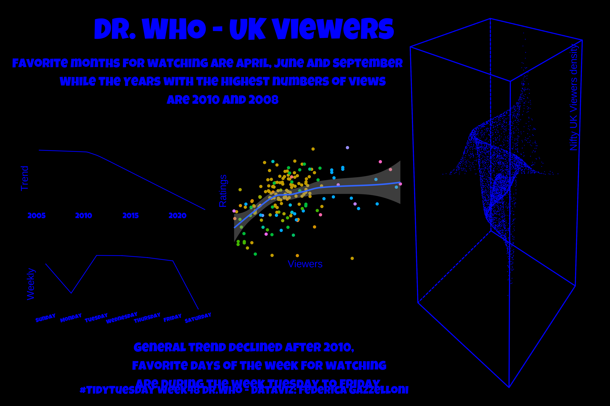
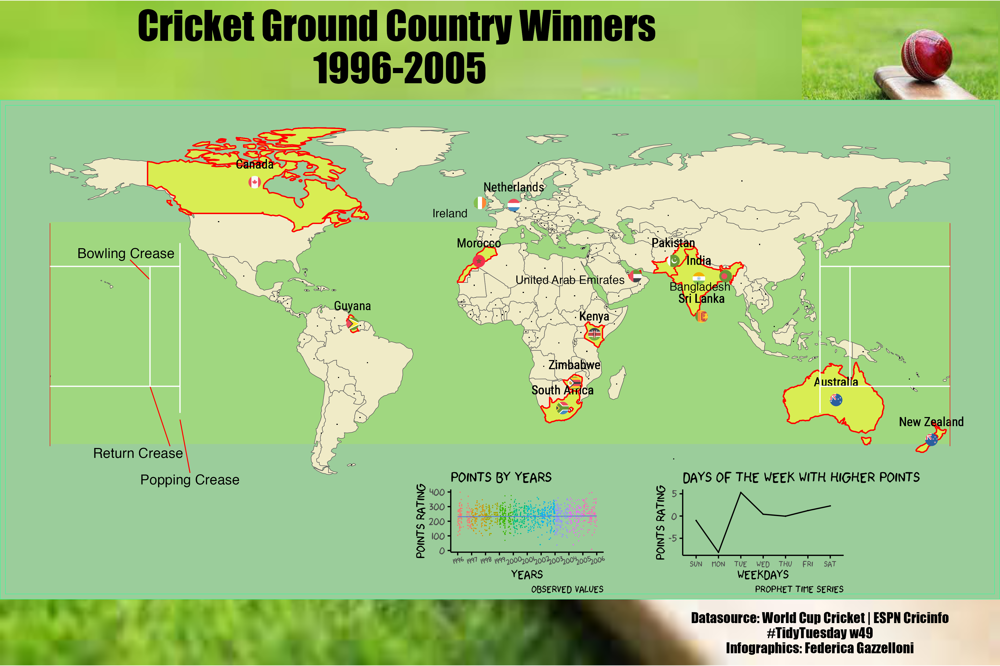

# TidyTuesday
several TidyTuesday interesting examples

https://github.com/rfordatascience/tidytuesday

# How to import data for TidyTuesday
Install R package from CRAN via: install.packages("tidytuesdayR")

# Examples of Imported Data 

tuesdata <- tidytuesdayR::tt_load("2018-05-07") 

data_for_plastic<-tt_load("2021-01-26")

# my contributions [Twitter: @fgazzelloni](https://twitter.com/fgazzelloni):

- [30DayChartChallenge-2021](https://github.com/Fgazzelloni/rstats-chart-challenge-2021)
- [30DayMapChallenge-2021](https://github.com/Fgazzelloni/30DayMapChallenge)

## My First TidyTuesday
UN Votes week 13 - Harvard Dataverse	Citizen Statistician

## Day 13 

2021-03-23 | [UN Votes](https://github.com/rfordatascience/tidytuesday/blob/master/data/2021/2021-03-23/readme.md) 
 

## Day 14 

2021-03-30 | [Makeup Shades](https://github.com/rfordatascience/tidytuesday/blob/master/data/2021/2021-03-30/readme.md) 
 

## Day 15 
2021-04-06 | [Global deforestation](https://github.com/rfordatascience/tidytuesday/blob/master/data/2021/2021-04-06/readme.md) 
 

## Day 16 
2021-04-13 | [US Post Offices](https://github.com/rfordatascience/tidytuesday/blob/master/data/2021/2021-04-13/readme.md) 
 

## Day 17 
2021-04-20 | [Netflix Titles](https://github.com/rfordatascience/tidytuesday/blob/master/data/2021/2021-04-20/readme.md) 
 

## Day 18 
2021-04-27 | [CEO Departures](https://github.com/rfordatascience/tidytuesday/blob/master/data/2021/2021-04-27/readme.md) 

## Day 19 
2021-05-04 | [Water Access Points](https://github.com/rfordatascience/tidytuesday/blob/master/data/2021/2021-05-04/readme.md) 
 

## Day 20 
2021-05-11 | [US Broadband](https://github.com/rfordatascience/tidytuesday/blob/master/data/2021/2021-05-11/readme.md) 

## Day 21 
2021-05-18 | [Ask a Manager Salary Survey](https://github.com/rfordatascience/tidytuesday/blob/master/data/2021/2021-05-18/readme.md) 

## Day 22 
2021-05-25 | [Mario Kart World Records](https://github.com/rfordatascience/tidytuesday/blob/master/data/2021/2021-05-25/readme.md) 

## Day 23 
2021-06-01 | [Survivor TV Show](https://github.com/rfordatascience/tidytuesday/blob/master/data/2021/2021-06-01/readme.md) 

## Day 24 
2021-06-08 | [Great Lakes Fish](https://github.com/rfordatascience/tidytuesday/blob/master/data/2021/2021-06-08/readme.md) 

## Day 25 
2021-06-15 | [WEB Du Bois and Juneteenth](https://github.com/rfordatascience/tidytuesday/blob/master/data/2021/2021-06-15/readme.md) 

## Day 26 
2021-06-22 | [Public Park Access](https://github.com/rfordatascience/tidytuesday/blob/master/data/2021/2021-06-122/readme.md) 

## Day 27 
2021-06-29` | [Animal Rescues](https://github.com/rfordatascience/tidytuesday/blob/master/data/2021/2021-06-29/readme.md) 

## Day 28 
2021-07-06 | [International Independence Days](https://github.com/rfordatascience/tidytuesday/blob/master/data/2021/2021-07-06/readme.md) 

## Day 29 
2021-07-13` | [Scooby Doo](https://github.com/rfordatascience/tidytuesday/blob/master/data/2021/2021-07-13/readme.md) 

## Day 30 
2021-07-20 | [US Droughts](https://github.com/rfordatascience/tidytuesday/blob/master/data/2021/2021-07-20/readme.md) 

## Day 31 
2021-07-27 | [Olympic Medals](https://github.com/rfordatascience/tidytuesday/blob/master/data/2021/2021-07-27/readme.md) 

## Day 32 
2021-08-03 | [Paralympic Medals](https://github.com/rfordatascience/tidytuesday/blob/master/data/2021/2021-08-03/readme.md) 

## Day 33 
2021-08-10 | [BEA Infrastructure Investment](https://github.com/rfordatascience/tidytuesday/blob/master/data/2021/2021-08-10/readme.md) 

## Day 34 
2021-08-17 | [Star Trek Voice Commands](https://github.com/rfordatascience/tidytuesday/blob/master/data/2021/2021-08-17/readme.md) 

## Day 35 
2021-08-24 | [Lemurs](https://github.com/rfordatascience/tidytuesday/blob/master/data/2021/2021-08-24/readme.md) 

## Day 36 
2021-08-31 | [Bird Baths](https://github.com/rfordatascience/tidytuesday/blob/master/data/2021/2021-08-31/readme.md) 

## Day 37 
2021-09-07 | [Formula 1 Races](https://github.com/rfordatascience/tidytuesday/blob/master/data/2021/2021-09-07/readme.md) 

## Day 38 
2021-09-14 | [Billboard Top 100](dhttps://github.com/rfordatascience/tidytuesday/blob/master/data/2021/2021-09-14/readme.md) 

## Day 39 
2021-09-21 | [Emmy Awards](https://github.com/rfordatascience/tidytuesday/blob/master/data/2021/2021-09-21/readme.md) 

## Day 40 
2021-09-28` | [NBER Papers](https://github.com/rfordatascience/tidytuesday/blob/master/data/2021/2021-09-28/readme.md) 

## Day 41 
2021-10-05 | [Registered Nurses](https://github.com/rfordatascience/tidytuesday/blob/master/data/2021/2021-10-05/readme.md) 

## Day 42 
2021-10-12 | [Global Seafood](https://github.com/rfordatascience/tidytuesday/blob/master/data/2021/2021-10-12/readme.md) 

## Day 43 
2021-10-19 | [Big Pumpkins](https://github.com/rfordatascience/tidytuesday/blob/master/data/2021/2021-10-19/readme.md) 

## Day 44 
2021-10-26 | [Ultra Trail Running](https://github.com/rfordatascience/tidytuesday/blob/master/data/2021/2021-10-26/readme.md) 

## Day 45 
2021-11-02 | [Making maps with R](https://github.com/rfordatascience/tidytuesday/blob/master/data/2021/2021-11-02/readme.md) 

## 46
2021-11-09 | [Learning with `afrilearndata`](https://github.com/rfordatascience/tidytuesday/blob/master/data/2021/2021-11-09/readme.md) 

## 47
2021-11-09 | [`#BlackInDataWeek` 2021](https://github.com/rfordatascience/tidytuesday/blob/master/data/2021/2021-11-16/readme.md) 

## 48
2021-11-23 | [Dr. Who](dhttps://github.com/rfordatascience/tidytuesday/blob/master/data/2021/2021-11-23/readme.md)

## 49
2021-11-30 | [World Cup Cricket](https://github.com/rfordatascience/tidytuesday/blob/master/data/2021/2021-11-30/readme.md)

## 50
2021-12-07 | [Spiders](https://github.com/rfordatascience/tidytuesday/blob/master/data/2021/2021-12-07/readme.md)

