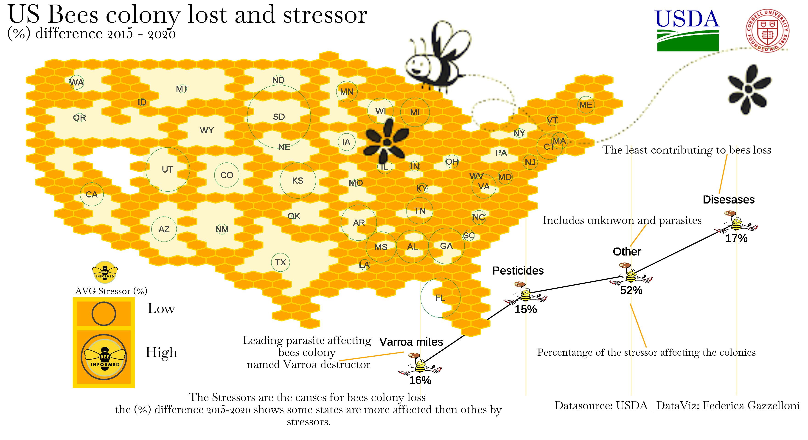
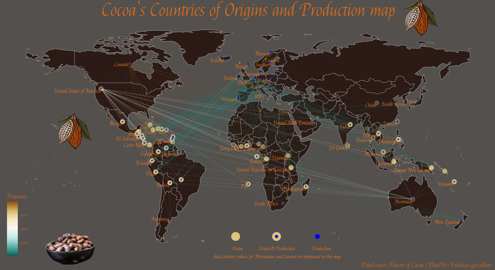

# TidyTuesday

TidyTuesday project is a weekly appointment that happens on every Tuesday for practicing making #DataVisualization with datasets provided by the #`R4DS Online Learning Community`

Several TidyTuesday interesting examples can be found in the main repository:

- https://github.com/rfordatascience/tidytuesday

***
#### How to make a #TidyTuesday (more info at the bottom of this page) 

***
### My contributions are posted on: 

#### Twitter @[fgazzelloni](https://twitter.com/fgazzelloni) and collected in this repository with related code.

***
#### Other #DataViz projects I contribute to:

##### - [30DayChartChallenge-2021](https://github.com/Fgazzelloni/rstats-chart-challenge-2021)
##### - [30DayChartChallenge-2022](https://github.com/Fgazzelloni/30DayChartChallenge)
##### - [30DayMapChallenge-2021](https://github.com/Fgazzelloni/30DayMapChallenge)

***
# My #TidyTuesdays
## [2021](data/2021/gather/table_collage_2021.png) | [2022](data/2022)

|[Week1 Bring your own data to start 2022](data/2022/w1_your_own_data/)| [Week2](data/2022/w2_bees) [Bee Colony losses](https://github.com/rfordatascience/tidytuesday/blob/master/data/2022/2022-01-11/readme.md)| [Week3](data/2022/w3_chocolate) [Chocolate Bar ratings](https://github.com/rfordatascience/tidytuesday/blob/master/data/2022/2022-01-18/readme.md)| [Week4](data/2022/w4_board_games) [Board games](https://github.com/rfordatascience/tidytuesday/blob/master/data/2022/2022-01-25/readme.md)|
| :---: | :---: | :---: | :---: 
|||||
[Week5](data/2022/w5_dogs) [Dog breeds](https://github.com/rfordatascience/tidytuesday/blob/master/data/2022/2022-02-01/readme.md)|[Week6](data/2022/w6_airforce) [Tuskegee Airmen](https://github.com/rfordatascience/tidytuesday/blob/master/data/2022/2022-02-08/readme.md)|[Week7](ata/2022/w7_dubois) [`#DuBoisChallenge2022`](https://github.com/rfordatascience/tidytuesday/blob/master/data/2022/2022-02-15/readme.md) | [Week8](data/2022/w8_wfi) [World Freedom index](https://github.com/rfordatascience/tidytuesday/blob/master/data/2022/2022-02-22/readme.md)| 
||||
|[Week9](data/2022/w9_stations) [Alternative Fuel Stations](https://github.com/rfordatascience/tidytuesday/blob/master/data/2022/2022-03-01/readme.md)|[Week10](data/2022/w10_erasmus) [Erasmus student mobility](https://github.com/rfordatascience/tidytuesday/blob/master/data/2022/2022-03-08/readme.md)|[Week11](data/2022/w11_vignettes) [CRAN/BIOC Vignettes](https://github.com/rfordatascience/tidytuesday/blob/master/data/2022/2022-03-15/readme.md)|[Week12](data/2022/w12_babynames) [Baby names](https://github.com/rfordatascience/tidytuesday/blob/master/data/2022/2022-03-22/readme.md)|
| |||
|[Week13](data/2022/w13_sports) [Collegiate Sports Budgets](https://github.com/rfordatascience/tidytuesday/blob/master/data/2022/2022-03-29/readme.md)|[Week14](data/2022/w14_digital_pub) [Digital Publications](https://github.com/rfordatascience/tidytuesday/blob/master/data/2022/2022-04-05/readme.md)|[Week15](data/2022/w15_indoor_pollution) [Indoor Air Pollution](https://github.com/rfordatascience/tidytuesday/blob/master/data/2022/2022-04-12/readme.md)|[Week16](data/2022/w16_crosswords) [Crossword Puzzles and Clues](https://github.com/rfordatascience/tidytuesday/blob/master/data/2022/2022-04-19/readme.md)|
||||
|[Week17](data/2022/w17_hidden_gems) [Kaggle Hidden Gems](https://github.com/rfordatascience/tidytuesday/blob/master/data/2022/2022-04-26/readme.md)|[Week18](data/2022/w18_solar_wind) [Solar/Wind utilities](https://github.com/rfordatascience/tidytuesday/blob/master/data/2022/2022-05-03/readme.md)|[Week19](data/2022/w19_nyt) [NYTimes best sellers](https://github.com/rfordatascience/tidytuesday/blob/master/data/2022/2022-05-10/readme.md)|[Week20](data/2022/w20_eurovision) [Eurovision](https://github.com/rfordatascience/tidytuesday/blob/master/data/2022/2022-05-17/readme.md)|
|||||
|[Week21](data/2022/w21_rugby) [Women's Rugby](https://github.com/rfordatascience/tidytuesday/blob/master/data/2022/2022-05-24/readme.md)|[Week22](data/2022/w22_reputation) [Company reputation poll](https://github.com/rfordatascience/tidytuesday/tree/master/data/2022/2022-05-31)|[Week23](data/2022/w23_pride) [Pride Corporate Accountability Project](https://github.com/rfordatascience/tidytuesday/tree/master/data/2022/2022-06-07)|[Week24](data/2022/w24_drought) [US Drought](https://github.com/rfordatascience/tidytuesday/tree/master/data/2022/2022-06-14)|
|||||
|[Week25](data/2022/w25_juneteenth) [Juneteenth](https://github.com/rfordatascience/tidytuesday/tree/master/data/2022/2022-06-21)|[Week26](data/2022/w26_paygap) [UK Gender pay gap](https://github.com/rfordatascience/tidytuesday/tree/master/data/2022/2022-06-28)|[Week27](data/2022/w27_rentals) [San Francisco Rentals](https://github.com/rfordatascience/tidytuesday/tree/master/data/2022/2022-07-05)|[Week28](data/2022/w28_european_flights) [European flights](https://github.com/rfordatascience/tidytuesday/tree/master/data/2022/2022-07-12)|
|||||
|[Week29](data/2022/w29_technology) [Technology](https://github.com/rfordatascience/tidytuesday/tree/master/data/2022/2022-07-19)|[Week30](data/2022/w30_BYOD) [BYOD](https://github.com/rfordatascience/tidytuesday/blob/master/data/2021/2021-08-10/readme.md)|[Week31](data/2022/w31_frogs) [Oregon Spotted Frog](https://github.com/rfordatascience/tidytuesday/tree/master/data/2022/2022-08-02)|[Week32](data/2022/w32_ferriswheels) [ferriswheels](https://github.com/rfordatascience/tidytuesday/tree/master/data/2022/2022-08-09)|
|||||
|[Week33](data/2022/w33_psychometrics) [Open Source Psychometrics](https://github.com/rfordatascience/tidytuesday/tree/master/data/2022/2022-08-16)|[Week34](data/2022/w34_chips) [CHIP dataset](https://github.com/rfordatascience/tidytuesday/tree/master/data/2022/2022-08-23)|[Week35](data/2022/w35_pell) [Pell Grants](https://github.com/rfordatascience/tidytuesday/tree/master/data/2022/2022-08-30)|[Week36](data/2022/w36_lego) [LEGO database](https://github.com/rfordatascience/tidytuesday/tree/master/data/2022/2022-09-06)|
|||||
|[Week37](data/2022/w37_bigfoot) [Bigfoot](https://github.com/rfordatascience/tidytuesday/tree/master/data/2022/2022-09-13)|[Week38](data/2022/w38_hydro_wastewater.Rmd) [Hydro Wastewater plants](https://github.com/rfordatascience/tidytuesday/tree/master/data/2022/2022-09-20)|[Week39](data/2022/w39_us_artists) [Artists in the USA](https://github.com/rfordatascience/tidytuesday/tree/master/data/2022/2022-09-27)|[Week40](data/2022/w40_product_hunt) [Product Hunt products](https://github.com/rfordatascience/tidytuesday/tree/master/data/2022/2022-10-04)|
|||||
|[Week41](data/2022/w41_...) [???](https://github.com/rfordatascience/tidytuesday/tree/master/data/2022/...)|[Week42](data/2022/w42_) [???](https://github.com/rfordatascience/tidytuesday/tree/master/data/2022/...)|[Week43](data/2022/w43_) [???](https://github.com/rfordatascience/tidytuesday/tree/master/data/2022/...)|[Week44](data/2022/w44_) [???](https://github.com/rfordatascience/tidytuesday/tree/master/data/2022/...)|
|||||
|[Week45](data/2022/w45_...) [???](https://github.com/rfordatascience/tidytuesday/tree/master/data/2022/...)|[Week46](data/2022/w46_) [???](https://github.com/rfordatascience/tidytuesday/tree/master/data/2022/...)|[Week47](data/2022/w47_) [???](https://github.com/rfordatascience/tidytuesday/tree/master/data/2022/...)|[Week48](data/2022/w44_) [???](https://github.com/rfordatascience/tidytuesday/tree/master/data/2022/...)|
|||||
|[Week49](data/2022/w49_...) [???](https://github.com/rfordatascience/tidytuesday/tree/master/data/2022/...)|[Week50](data/2022/w50_) [???](https://github.com/rfordatascience/tidytuesday/tree/master/data/2022/...)|[Week51](data/2022/w47_) [???](https://github.com/rfordatascience/tidytuesday/tree/master/data/2022/...)|[Week52](data/2022/w52_) [???](https://github.com/rfordatascience/tidytuesday/tree/master/data/2022/...)|
|||||

***
## INFO: How to make a #TidyTuesday

- Go to [R4DataScience GitHub repository](https://github.com/rfordatascience/tidytuesday)
- import data found in the [README](https://github.com/rfordatascience/tidytuesday/blob/master/README.md) at the middle bottom of the page is a table with the most updated data provided for the year/week
- click on the corresponding data tab in the table 
- load the data, two options are available: 

    1. Install {tidytuesdayR} package from CRAN via: `install.packages("tidytuesdayR")`, then load the data as suggested assigning a tuesdata variable name using the `tt_load()` function:
    
        `tuesdata <- tidytuesdayR::tt_load("date")`
        
        `tuesdata <- tidytuesdayR::tt_load(year, week)`
    
    2. Import the data directly from the .csv file provided 
