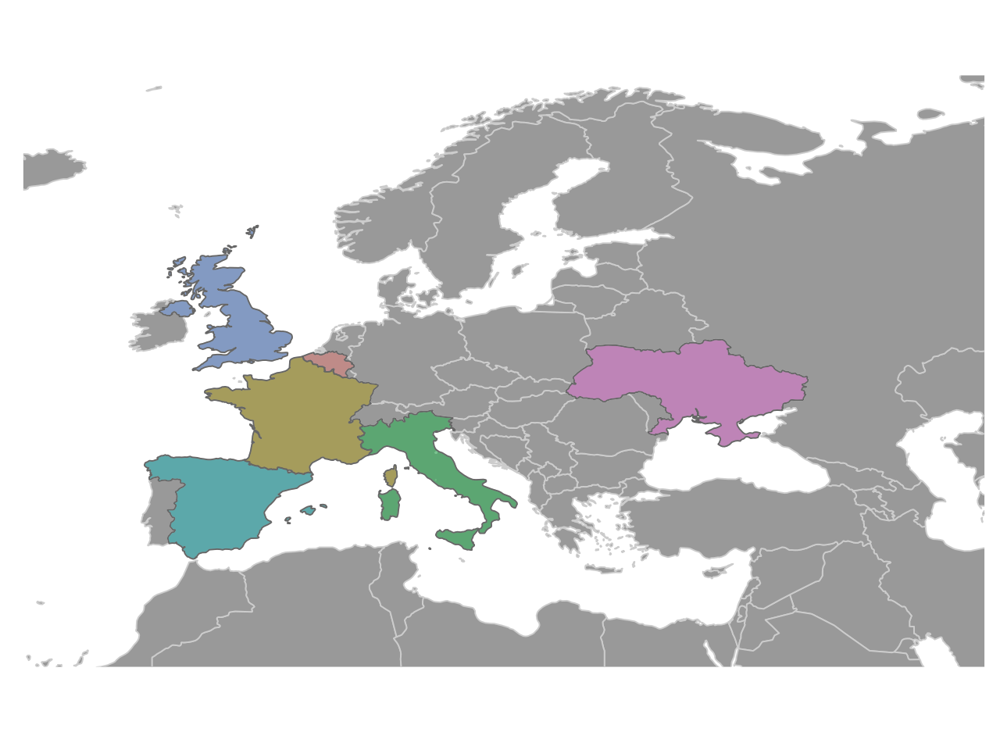

```{r setup, include=FALSE}
knitr::opts_chunk$set(echo = TRUE)
```

## European flights

### Load data

```{r message=FALSE, warning=FALSE, paged.print=FALSE}
library(tidyverse)
flights <- readr::read_csv('https://raw.githubusercontent.com/rfordatascience/tidytuesday/master/data/2022/2022-07-12/flights.csv')
# saveRDS(flights,"flights.rds")
# flights<-readRDS("flights.rds")
```


```{r}
flights<-flights%>%
  janitor::clean_names()
```


Check the number of airports for Ukraine:
```{r}
flights%>%count(state_name,apt_name)%>%
  filter(state_name=="Ukraine")
```


Compare the median of the total number of flights with Italy:
```{r}
flights%>%
  filter(state_name==c("Ukraine","Italy"))%>%
  count(state_name,pivot_label,year)%>%
  group_by(state_name) %>%
  summarize(total_median=median(n))
```

---

### Waffle

Make the first part of the visualization: waffles 
Selected are 6 countries with a varied number of airports and flights, this is done to give the idea of the differences.

```{r}
df<-flights%>%
  
  filter(state_name%in%c("Ukraine","Belgium","France","Italy",
                         "Spain","United Kingdom")) %>%
  mutate(state_name=ifelse(state_name=="United Kingdom","UK",state_name)) %>%
  group_by(state_name) %>%
  count(apt_name,sort=T) %>%
  mutate(apt_id=seq(1,length(state_name),1)) %>%
  summarise(tot=max(apt_id)) %>%
  arrange(-tot)

df
```

Load both libraries {waffle} and {ggsankey} to use a feature in the waffle which is provided in the ggsankey package.
```{r message=FALSE, warning=FALSE, paged.print=FALSE}
library(waffle)
library(ggsankey)
```


The waffles shows the number of airports for the selected countries on a total of 100.
```{r}
waffle <- df %>%
  mutate(rr = 100-tot) %>% # this is the remaining part of the 100 block
  pivot_longer(cols = c(tot,rr),names_to="values_name",values_to="values") %>% 
  arrange(state_name) %>%
  ggplot(aes(fill = values_name, values = values)) +
  geom_waffle(n_rows = 10, 
              size = 0.33, 
              make_proportional = F,
              colour = "white", 
              flip = TRUE,
              show.legend = F) +
  facet_wrap(~state_name,nrow = 1)+
  coord_equal() +
  scale_fill_manual(values=c("grey60","#8E0152"))+
  theme_sankey(base_size = 16) +
  theme_enhance_waffle() +
  theme(strip.text = element_blank(),
        plot.background = element_blank(),
        panel.background = element_blank())

waffle
```

### Sankey

The purpose of this **sankey** is to show the differences among the selected countries on number of airports and number of flights, from 2016 to 2022.

```{r}
sankey <- flights %>%
  count(state_name,apt_name) %>% 
  select(-n) %>%
  group_by(state_name) %>%
  count(apt_name,sort=T) %>%
  count(state_name,sort=T) %>%
  ungroup() %>%
  left_join(flights%>%select(state_name,flt_tot_1),by="state_name") %>%
  group_by(state_name,n) %>%
  summarize(tot=median(flt_tot_1),.groups="drop") %>%
  ungroup() %>%
  mutate(class = cut(n,
                     breaks = c(0,1,5,50,65)), #) %>% pull(tot) %>% summary()
         tot_class = cut(tot,
                         breaks = c(0,10,30,65,120,700))) %>% #count(tot_class)
  filter(state_name %in% c("Ukraine","Belgium","France","Italy",
                         "Spain","United Kingdom"))%>%
  mutate(state_name= ifelse(state_name=="United Kingdom","UK",state_name)) %>%
  mutate(class_id = case_when(class == "(0,1]" ~ "one",
                              class == "(1,5]" ~ "up to 5",
                              class == "(5,50]" ~ "up to 50",
                              TRUE ~ "up to 65"),
         tot_class_id = case_when(tot_class == "(0,10]" ~ "one",
                              tot_class == "(10,30]" ~ "up to 30",
                              tot_class == "(30,65]" ~ "up to 65",
                              tot_class == "(65,120]" ~ "up to 120",
                              TRUE ~ "up to 700")) %>%
  # function to make the object ready to be used in the geom_sankey
  make_long(tot_class_id,class_id,state_name) %>% 
  ggplot(aes(x = x, 
             label= node,
             next_x = next_x, 
             node = node, 
             next_node = (next_node),
             fill = factor(node))) +
  geom_sankey(flow.alpha = 0.8, 
              node.color = 1,
              show.legend = FALSE) +
  geom_sankey_text(angle=0,family = "Roboto Condensed", size = 3)+
  scale_fill_manual(values = colorRampPalette(RColorBrewer::brewer.pal(11, "PiYG"))(13))+
  theme_sankey(base_size = 16) +
  coord_flip(expand = F) +
  theme(axis.text = element_blank(),
        axis.title = element_blank(),
        plot.background = element_blank(),
        panel.background = element_blank())
  
sankey
```

### European Map

The map has been saved as map.png and sourced in the main visualization. The code can be found in a separate file named "eu_coords.R".

```{r echo=FALSE}

```


---

Use {cowplot} for assembling the plots, adding notes, the map and the logo as images.

```{r message=FALSE, warning=FALSE, paged.print=FALSE}
library(cowplot)
```

```{r}
 combo <- ggdraw() +
  draw_image("map.png",
             scale=0.5,
             x=0.3,y=0.4)+
  draw_plot(waffle,
            scale=1,
            x=0,y=0.2) +
  draw_plot(sankey, 
            scale=0.7,
            width = 1.4,
            height = 0.85,
            x=-0.2, y=-0.093) +
  draw_label("Countries such as France and Spain have the highest number of airports while this\nseems reasonable, other countries such as Ukraine with just one airport record\namong the countries with the highest total number of flights. Data are released\nwithin a range of 7 years from 2016 to 2022.",
             x=0.02,y=0.90,size=9,hjust=0, 
             fontfamily="Roboto Condensed") +
  draw_label("N. of airports", x=0.1,y=0.4,
             fontfamily="Roboto Condensed") +
  draw_label("N. of flights\n(median values)", x=0.1,y=0.16,
             fontfamily="Roboto Condensed") +
  draw_image("eurocontrol_logo.png",
             scale=0.1,
             x=-0.45,y=-0.52) +
  draw_label("Eurocontrol aviation intelligence\n(ansperformance.eu)",
             x=0.22,y=-0.02,size=9,fontfamily="Roboto Condensed")


combo
```


Use {ggpubr} for arranging the grid of the main visualization, so it can be annotate with `annotate_figure()` to making it a bit more standing out with spaces around the plot and top and bottmo annotations already at the right distance/position.

```{r message=FALSE, warning=FALSE, paged.print=FALSE}
library(ggpubr)
```

`ggpubr::annotate_figure()` provides a framework for annotating the plot on the four sides top, bottom, left and right. It comes a handy function when you'd like to position notes or even rich text at specified positions. To use it, it requires an object from `ggpubr::ggarrange()`.

```{r}
plot <- ggpubr::ggarrange(combo) 

  ggpubr::annotate_figure(plot,
               top = text_grob("Does the number of airports influence countries' aerial traffic?", 
                               color = c("#8E0152"), face = "bold", family = "Roboto Condensed", 
                               size = 18, vjust = 1.4),
               bottom = text_grob("DataSource:TidyTuesday 2022 week28 European flights\nDataViz: Federica Gazzelloni (@fgazzelloni)",
                                  color = "#8E0152",
                                  hjust = 1, x = 1, face = "italic",  family = "Roboto Condensed", 
                                  size = 10),
               left = text_grob("", color = c("#7FBC41"), rot = 90, size=10),
               right = text_grob(bquote(""), color=c("#DE77AE"), rot = 90, size=10),
                fig.lab = "European flights", fig.lab.face = "bold")
               
  
```


Then finally, save it as .png file with `ggsave()` function. I specified a height a little bit more than the default values provided as I needed more space.

The other arguments, `dpi` and `bg` are to set the pixels and the background color.

```{r}
ggsave("waffle_sankey.png",
       dpi=320,
       bg = "grey95",
       height = 7.2)
```


