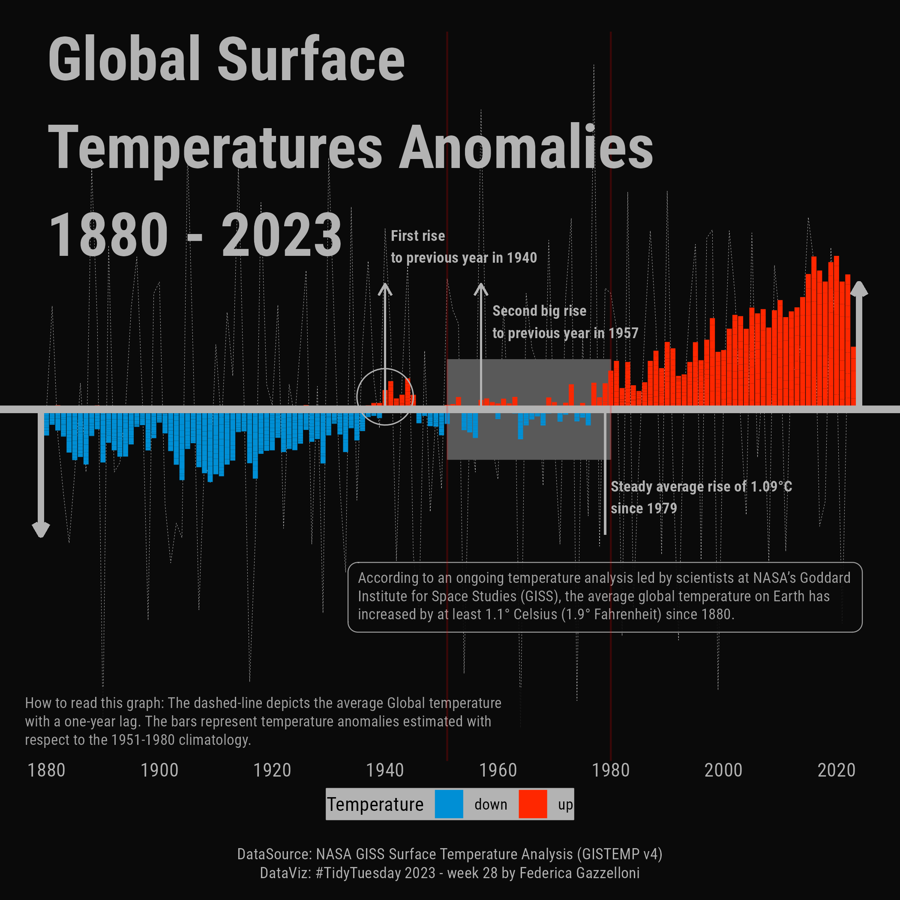

# My 2023 TidyTuesdays

2023 series of `#TidyTuesday` data visualizations.

|                                                                                                                            |                                                                                                                                                                                                    |                                                                                                                                                                                                                                                                                               |                                                                                                                            |
|-----------------|-----------------------|-----------------|-----------------|
|          |                                                                                                                                                                     |                                                                                                                                                                                                                                                                |       |
|       |                                                                                                                                                                     |                                                                                                                                                                          |       |
|       |  |                                                                                                                                                                                                                                                             |                                                                                          |
|  |                                                                                                                                                                  |                                                                                                                                                                     |       |
|            | 18                                                                                                                                                                                                 | 19                                                                                                                                                                                                                                                                                            | 20                                                                                                                         |
| 21                                                                                                                         | 22                                                                                                                                                                                                 | 23                                                                                                                                                                                                                                                                                            | 24                                                                                                                         |
| 25                                                                                                                         | 26                                                                                                                                                                                                 | 27                                                                                                                                                                                                                                                                                            |  |
| 29                                                                                                                         | 30                                                                                                                                                                                                 | 31                                                                                                                                                                                                                                                                                            | 32                                                                                                                         |
| 33                                                                                                                         | 34                                                                                                                                                                                                 | 35                                                                                                                                                                                                                                                                                            | 36                                                                                                                         |
| 37                                                                                                                         | 38                                                                                                                                                                                                 | 39                                                                                                                                                                                                                                                                                            | 40                                                                                                                         |
| 41                                                                                                                         | 42                                                                                                                                                                                                 | 43                                                                                                                                                                                                                                                                                            | 44                                                                                                                         |
| 45                                                                                                                         | 46                                                                                                                                                                                                 |  | 48                                                                                                                         |
| 49                                                                                                                         | 50                                                                                                                                                                                                 | 51                                                                                                                                                                                                                                                                                            | 52                                                                                                                         |
